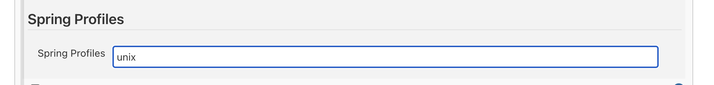
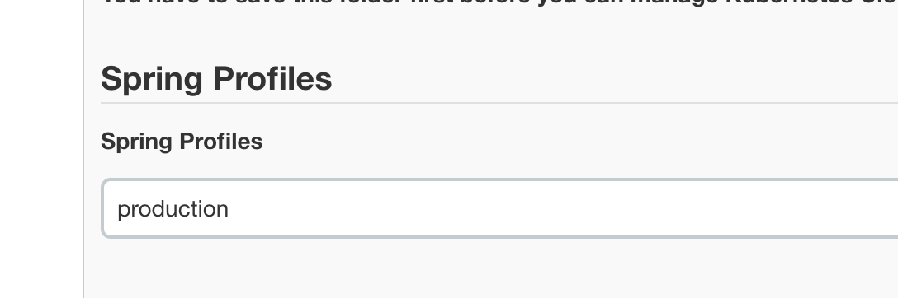

# Spring Config Plugin
This plugin is used to read [Spring Boot style application properties files](https://docs.spring.io/spring-boot/docs/current/reference/html/spring-boot-features.html#boot-features-external-config-application-property-files).

## Define the profile names
Profile names can be defined at job configuration.

Or job folder configuration

In structures where two or more folders are nested, all profile name are merged together.

## Retrieve the profile names
Use `SpringProfiles()` to retrieve the profile names defined
```groovy
def profiles=springProfiles()
```

## Get value from spring application style configuration file
This plugin supports custom location and profiles. The returned value is a nested Map object.  

Suppose there's a yaml style `application.yaml` config file.
```yaml
foo:
  bar: value1
```
Read the config file
```groovy

def config=springConfig()
print config.foo.bar // Nested style
print config.asProperties()['foo.bar'] // All keys are flattened
print config.asPropertiesFileContent()  // It returns standard Java properties file format. All no ascii string are escapted.
``` 
Each build has a 'Spring Config' page which shows the configuration read by this plugin. 

## Parameters
 - profiles: A list of profiles. See detail at [Spring Document](https://docs.spring.io/spring-boot/docs/current/reference/html/spring-boot-features.html#boot-features-external-config-profile-specific-properties).
    
 - location: The custom location. The plugin reads the configuration files either at current directory (workspace root or [dir](https://www.jenkins.io/doc/pipeline/steps/workflow-basic-steps/#dir-change-current-directory) step) or a ```config``` sub directory. If not in these two, a relative path must be specified. This path must end with '/' if it is a directory.
 
 - hideInBuildPage: Don't show the configurations in the build 'Spring Config' page.

Example: 
 ```groovy
 def profiles=springProfiles()
 def config=springConfig(profiles: profiles, location : 'custom-config/,custom-config2/')
```

